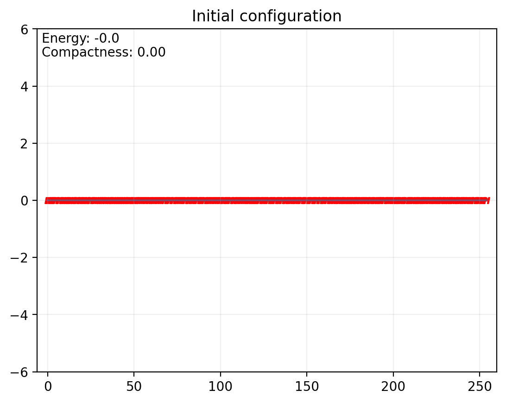
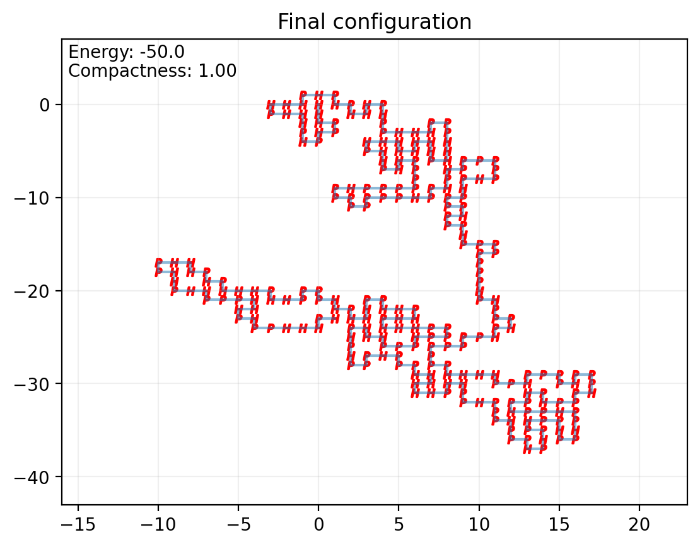
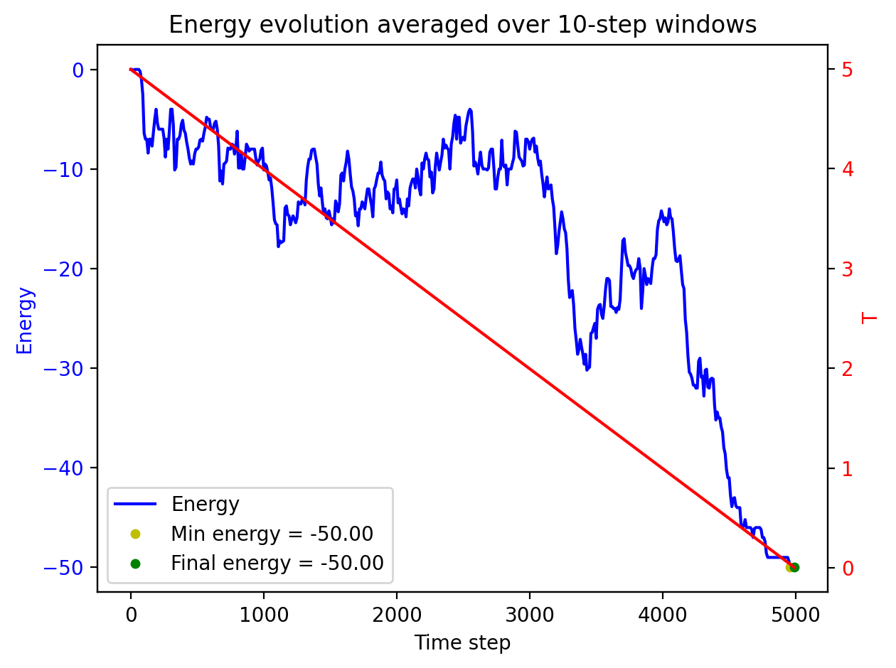
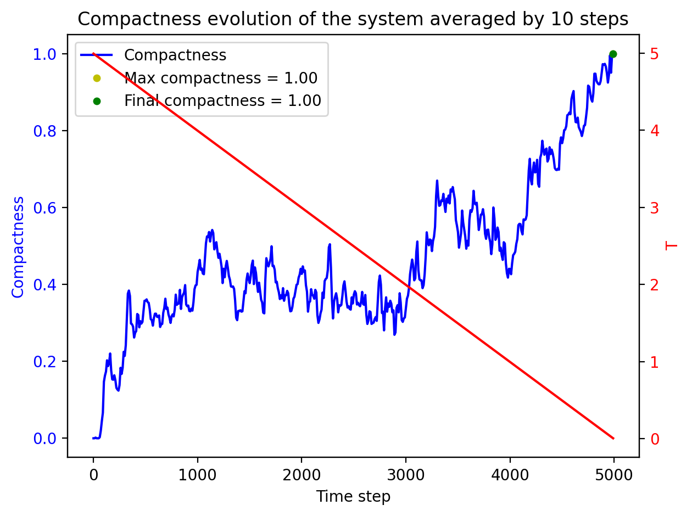
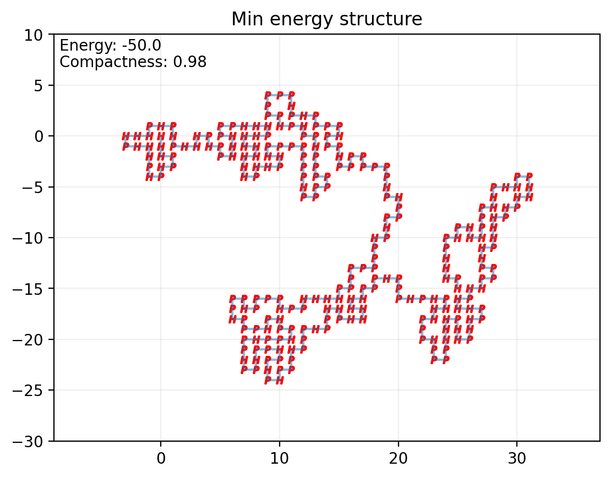
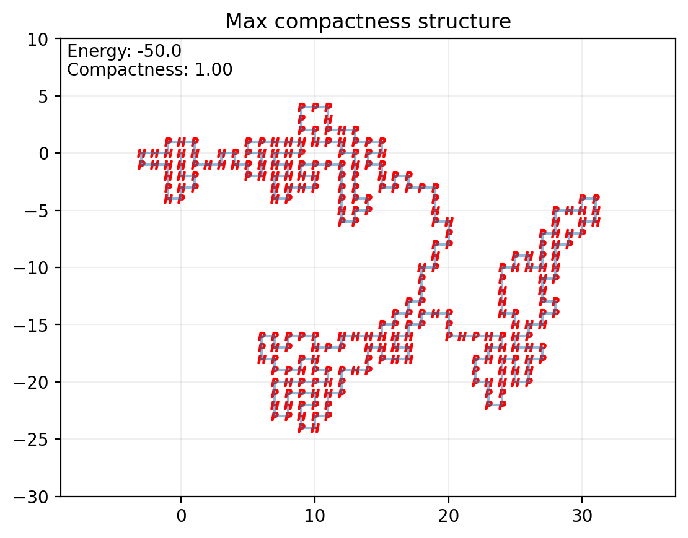

# HP Lattice Model for Protein Folding

This project implements the HP lattice model for protein folding in Python.

The HP lattice model is a simplified approach to explore basic protein folding behaviors via Monte Carlo simulations
that explore the free energy landscape of protein configurations. It reduces protein sequences to two amino acid
categories: H (hydrophobic) and P (polar). For
more information, see [this paper](https://pubs.acs.org/doi/10.1021/ma00200a030) or
the [theory section](#-theoretical-background) below.

A command-line interface allows running simulations with configurable temperature and optional annealing, producing
energy evolution, structures (foldings), minimum-energy configurations, and compactness.

## Installation and Running

Clone the repository, move to the project directory, create a Python virtual environment, install dependencies, and run
the application:

```shell
python -m venv .venv
source .venv/bin/activate
pip install -r requirements.txt
python src/main.py
```

## Parameter Settings

You can modify protein sequences, structures, and other parameters by editing the `config.yaml` file or creating a new
one.

```yaml
# Sequences can use just H/P monomers
# or all 20 amino acids (automatically converted to H/P).
sequence: MGLSDGEWQLVLNV...

# This is an optional initial structure (fold)
structure:
  use_structure: false
  coordinates: [ [ 0,0 ], [ 0,1 ], ... ]  # only needed if use_structure: true

# Simulation configuration
simulation:
  folding_steps: 5000  # Number of folding steps
  annealing: true  # Whether to apply annealing or not
  temperature: 5.0  # Initial annealing temperature

# Plot configuration
plot:
  create_gif: true  # Whether to create a gif for representing evolution or not

# Seed for reproducibility (set none for random)
seed: 42
```

<!--
## Repository Structure

```plaintext
HP_model/
├── output/
│   └── ...plots and outputs
├── config.yaml
├── src/
│   ├── __init__.py
│   ├── main.py
│   ├── protein.py
│   ├── fold_sampler.py
│   ├── simulation.py
│   ├── tracker.py
│   ├── metropolis.py
│   ├── plots.py
│   ├── config.py
│   ├── geometry.py
│   ├── validation.py
│   ├── transforms.py
│   └── utils.py
├── test/
│   ├── __init__.py
│   ├── config_test.yaml
│   └── test.py
└── requirements.txt
```

Main Python files:

- `output/`: Directory containing plots and other outputs
- `config.yaml`: Input and simulation configuration
- `src/main.py`: Entry point — initializes the protein, runs the simulation, and saves results to `output/`
- `src/protein.py`: Defines the `Protein` class with sequence, fold, and physical properties (energy, compactness,
  neighbors)
- `src/fold_sampler.py`: Generates valid random folds (self-avoiding walks) via geometric transformations; isolated from
  simulation logic
- `src/simulation.py`: Defines the `Simulation` class, which orchestrates the Metropolis evolution loop with optional
  simulated annealing
- `src/tracker.py`: Defines `SimulationTracker`, which records energy, compactness, and temperature histories, best-fold
  snapshots, and optional GIF frames
- `src/metropolis.py`: Defines the Metropolis step acceptance rule
- `src/utils.py`: Helper functions for validation, configuration parsing, and sequence conversion
- `src/plots.py`: Plotting functions for results visualization (energy, compactness, structures, GIF creation)
- `src/config.py`: Handles YAML configuration parsing and provides structured access to simulation parameters
- `src/geometry.py`: Provides geometric utilities for protein folds (distance computation, linear structure generation,
  coordinate handling)
- `src/validation.py`: Contains validation utilities for sequences and protein folds (self-avoiding walk checks, input
  validation)
- `src/transforms.py`: Implements geometric transformations used for fold sampling (rotations, reflections, diagonal and
  local moves)
- `test/test.py`: Test suite for code validation
- `test/config_test.yaml`: Configuration for test runs (do not modify). To run tests: use `pytest test/test.py`
- `requirements.txt`: All dependencies for the project

-->

## Theoretical Background

Protein folding is the biological process through which proteins acquire their three-dimensional structure, known as the
native state (or native conformation). This structure is essential for the protein’s biological function and emerges
through a self-assembly process driven by non-covalent interactions. When folding occurs incorrectly (misfolding),
proteins can become dysfunctional and may lead to disease.

Protein folding can be seen as a descent toward a stable state ruled by thermodynamic principles. The native
conformation is generally considered the state of minimum free energy. This minimum corresponds to the most stable
thermodynamic equilibrium, where internal forces and biological interactions are balanced, and no spontaneous changes
can further reduce the energy. The folding process is often visualized as an energy landscape, where the native state
lies in the deepest region (global minimum).

The HP lattice model simplifies protein folding by categorizing amino acids as either hydrophobic (H) or polar (P).
Hydrophobic amino acids tend to cluster inside the protein to avoid water, while polar residues remain on the surface.
This model is mainly educational and helps introduce the basic principles of protein folding, although real protein
folding involves many additional factors. More advanced models are used for accurate predictions.

### Monte Carlo simulation algorithm

1. **Initialization**:
    * $\alpha :=$ initial protein fold
    * $T :=$ initial temperature for annealing
2. **Main Loop** (Repeat for $n$ steps):
    * Optionally, decrease temperature $T$ (anneal)
    * Compute current energy $E(\alpha)$
    * Generate new random fold $\alpha'$
    * Calculate $\Delta E := E(\alpha') - E(\alpha)$
    * If $\Delta E < 0$:
        * $\alpha \leftarrow \alpha'$ // Accept new fold $\alpha'$
    * Else:
        * Accept new fold with probability $p = e^{-\frac{\Delta E}{k_B T}}$

### Computing $E(\alpha)$

The energy $E$ of a fold $\alpha$ is defined by the number of non-consecutive H-H contacts. For every pair of H-monomers
that are adjacent on the lattice but not in the primary sequence (backbone), the system's energy is reduced by a factor
of $\varepsilon = 1$.

1. **Initialization**:
    * $n_{contacts} := 0$
2. **Monomer Loop** (For each monomer $i$ in the protein sequence):
    * If monomer $i$ is **Hydrophobic**:
        * $neighbors(i) \leftarrow$ `get_neighbors(i)` // excluding $i \pm 1$ neighbors
        * $n_{contacts} \leftarrow n_{contacts} + |neighbors(i)|$
3. **Final Calculation**:
    * $E(\alpha) \leftarrow - \varepsilon \times \frac{n_{contacts}}{2}$ // unique contacts
4. **Result**:
    * **Return** $E(\alpha)$

### Generating a Random Fold

A random monomer (between 1 and length-2) of the protein is selected and the tail starting from that position is
modified using a random geometric transformation, such as a rotation, reflection, or diagonal move when allowed. The
transformed tail is then reattached to the unchanged part of the protein. The new configuration is accepted only if it
forms a valid self-avoiding walk, ensuring that no overlaps occur. Once validated, the resulting configuration becomes
the new protein fold.

### Folding Acceptance

After generating a random fold, its energy is computed and accepted according to
the [Metropolis algorithm](https://en.wikipedia.org/wiki/Metropolis–Hastings_algorithm).
In this specific implementation, only topological contacts between H-H monomers decrease the system's energy. More
formally:

- If the new structure's energy is lower, accept it.
- If higher, accept with probability:

$$
p = e^{-\frac{\Delta E}{k_B T}}
$$

Where:

- $e$ — [Euler's number](https://en.wikipedia.org/wiki/E_(mathematical_constant)) (≈ 2.71828)
- $\Delta E$ — energy difference between folds
- $k_B$ — [Boltzmann constant](https://en.wikipedia.org/wiki/Boltzmann_constant) (set to 1)
- $T$ — temperature (for optional annealing)

**Notes**

- $k_B = 1$ simplifies the simulation and comparisons between runs
- All quantities are treated as dimensionless
- Double-counting of contacts is automatically handled for correct energy and compactness

## Simulation Example

This example runs on a simulation of the [Myoglobin (Camelus dromedarius) protein
sequence](https://www.ncbi.nlm.nih.gov/protein/KAB1270346.1?report=fasta).

- Simulate 5000 folding steps
- Starting annealing temperature: 5.0

Results (found in the `output/` folder):

- Initial protein sequence:\
  
- Evolution process:\
  
- Final protein folding:\
  
- Energy evolution:\
  
- Compactness evolution:\
  
- Minimum energy folding\
  
- Maximum compactness folding\
  

The plots show how energy and compactness stabilize as the temperature decreases. The lowest energy configuration does
not necessarily correspond to the highest compactness.
