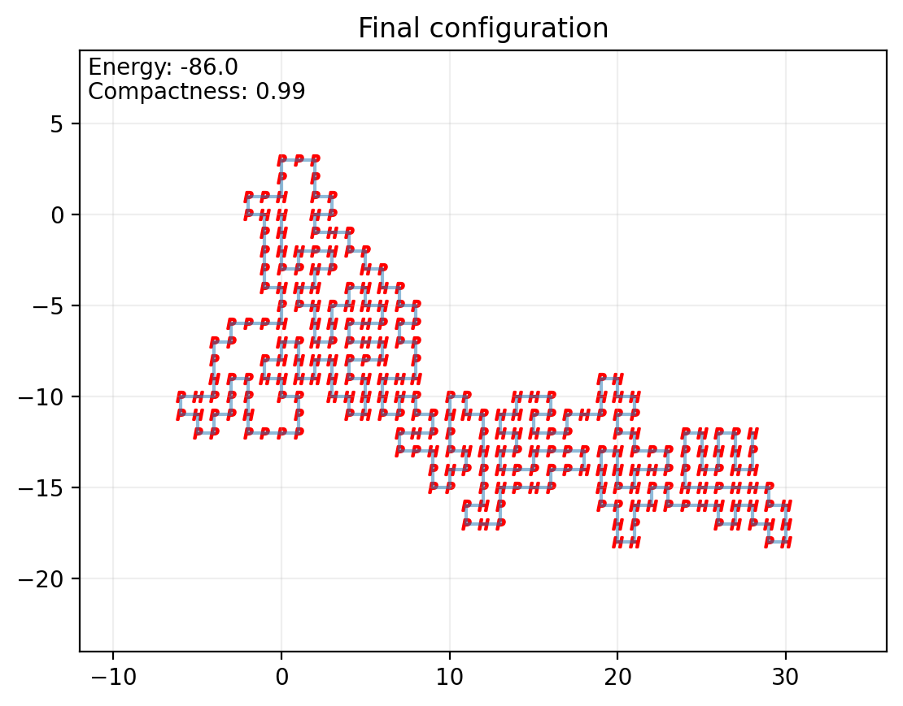
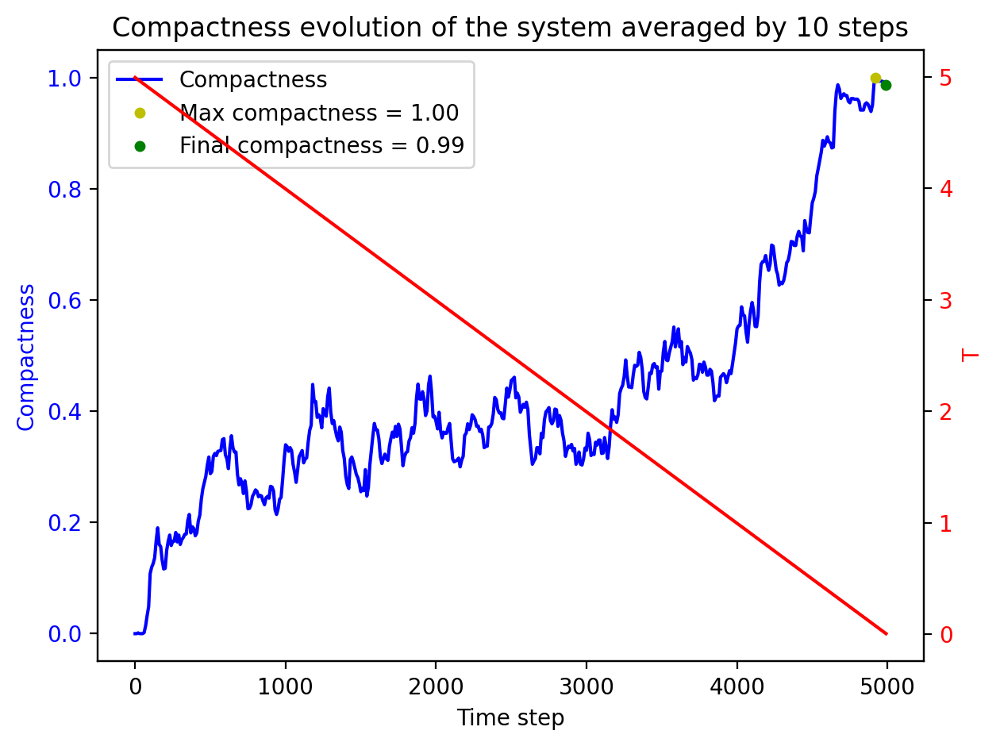
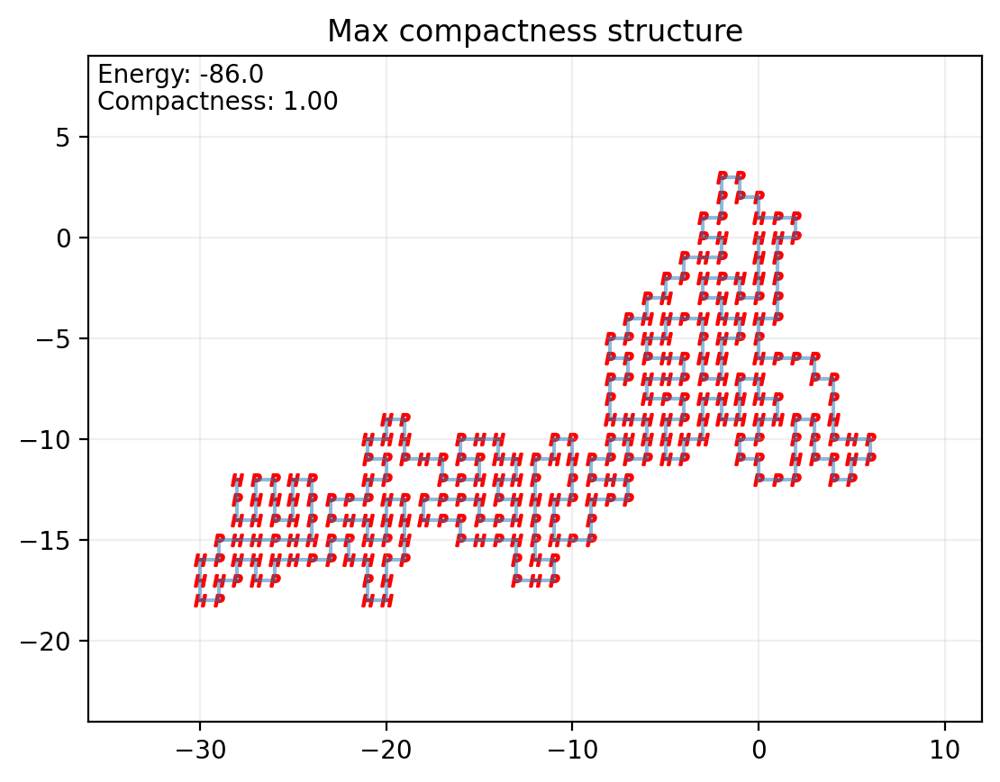

# HP Model for Protein Folding 🧬

This project implements the HP model for protein folding in Python.

The HP model is a simplified approach to explore basic protein folding behaviors via Monte Carlo simulations on the free
energy of protein bonds. It reduces protein sequences to two amino acid categories: H (hydrophobic) and P (polar). For
more information, see [this paper](https://pubs.acs.org/doi/10.1021/ma00200a030) or
the [theory section](#-theoretical-background) below.

A command-line application is included, allowing users to input a protein sequence (using all 20 standard amino acids or
H/P only), run HP model simulations at chosen temperatures, optionally apply annealing algorithms, and output the energy
evolution, protein structures, minimum energy configurations, and compactness.

This project provides a first look at protein behavior and can be used to study transitions to native states as a
function of temperature and binding energy. Various tests and comparisons are possible, such as observing the folding
behavior when two random adjacent amino acids are swapped.

## 📋 Table of Contents

1. [Installation & Running](#-installation--running)
2. [Parameter Settings](#%EF%B8%8F-parameter-settings)
    1. [Insert the Protein Sequence](#-insert-the-protein-sequence)
    2. [Change the Number of Folding Steps](#-change-the-number-of-folding-steps)
    3. [Other Parameters](#-other-parameters)
    4. [Create a Custom Configuration File](#-create-a-custom-configuration-file)
3. [Repository Structure](#-repository-structure)
4. [Theoretical Background](#-theoretical-background)
    1. [Folding Algorithm](#-folding-algorithm)
    2. [Structure Acceptance](#-structure-acceptance)
5. [Execution Example](#%EF%B8%8F-execution-example)

## 🚀 Installation & Running

It is **recommended** to create a virtual environment before installing dependencies, to keep your Python workspace
clean and isolated.

You can do this with:

```shell
python3 -m venv .venv
source .venv/bin/activate  # On Windows use: .venv\Scripts\activate
```

All required packages are listed in `requirements.txt`.

To install them, after activating your environment, run:

```shell
pip install -r requirements.txt
```

From your terminal, navigate to your desired folder and clone the repository:

```shell
git clone https://github.com/TommyGiak/HP_model.git
```

After cloning, the main script with:

```shell
python src/main.py
```

The default configuration file is `config.yaml` in the `src` folder. All parameters are configurable; for more details,
see the [parameters section](#%EF%B8%8F-parameter-settings).

To create a custom configuration file, check [this guide](#-create-a-custom-configuration-file).

### Requirements

All dependencies are specified in `requirements.txt`, use this file to set up your environment!

## ⚙️ Parameter Settings

You can modify protein sequences, structures, and other parameters by editing the `config.yaml` file or creating a new
configuration file.

### 🔡 Insert the Protein Sequence

Write the sequence in the `sequence` field inside `config.yaml` (uppercase letters only, no quotes).  
Sequences can use just H/P monomers or all 20 amino acids (automatically converted to H/P).

### 🔢 Change the Number of Folding Steps

Set the number of folding steps via the `folding_steps` variable under the `simulation` section in `config.yaml`.

### 🛠 Other Parameters

- Enable or disable annealing: `annealing: true` or `annealing: false` in `simulation`
- Use a specific initial structure: set `use_structure: true` and provide a list of coordinates in `structure`. Sequence
  and structure lengths must match!
- Set initial temperature: `temperature` in `simulation`
- Create a GIF of the process: `create_gif: true` or `create_gif: false` in `plot`
- Set a random seed: `seed` in `config.yaml` (or `None` for random)

### 📝 Create a Custom Configuration File

Copy the syntax from `config.yaml` and adjust parameters as needed.  
To use your file, simply update the path in the main script if necessary.  
Custom configuration files can use any extension supported by PyYAML.

Example `config.yaml` structure:

```yaml
sequence: MGLSDGEWQLVLNVWGKVEADVAGHGQEVLIRSHVWGECPVLPALLSGVRALSESHQKRLRKDSRDDDGDDGDGDNDNDDGDGDDDDGDDDGDNDNDDDDGDGDDDGDGDDDRDDSDGGGGDHADDDNGNDDGDDDGHPETLEKFDKFKHLKTADEMKASEDLKKHGNTVLTALGGILKKKGHHEAELKPLAQSHATKHKIPVKYLEFISDAIIHVLQSKHPGDFGADAQAAMNKALELFRNDMAAKYKELGFQG

structure:
  use_structure: false
  coordinates: [ [ 0,0 ], [ 0,1 ], ... ]  # only needed if use_structure: true

simulation:
  folding_steps: 5000
  annealing: true
  temperature: 5.0

plot:
  create_gif: true

seed: 42
```

## 📁 Repository Structure

```plaintext
HP_model/
├── output/
│   └── ...plots and outputs
├── src/
│   ├── __init__.py
│   ├── config.yaml
│   ├── main.py
│   ├── plots.py
│   ├── protein_class.py
│   └── utils.py
├── test/
│   ├── __init__.py
│   ├── config_test.yaml
│   └── test.py
└── requirements.txt
```

Main Python files:

- `src/main.py`: Runs simulations and saves results to `output/`
- `src/protein_class.py`: Defines the `Protein` class and key evolution methods
- `src/utils.py`: Helper functions for validation, configuration, and sequence conversion
- `src/plots.py`: Plotting functions for results visualization (energy, compactness, structures, GIF creation)
- `src/config.yaml`: Main input configuration
- `test/test.py`: Test suite for code validation
- `test/config_test.yaml`: Configuration for test runs (do not modify).  
  To run tests: use `pytest test/test.py`.
- `requirements.txt`: All dependencies for the project

## 📚 Theoretical Background

The HP model simplifies protein folding by categorizing amino acids as either hydrophobic (H) or polar (P).  
Hydrophobic amino acids cluster inside the protein to avoid water, while polar ones remain on the surface.  
This model is educational and helps introduce protein folding basics, but real folding involves many more factors.
Researchers use more advanced models for accurate predictions.

### 🧩 Folding Algorithm

The folding algorithm is implemented in the `Protein` class (`protein_class.py`), with utility functions in
`utils.py`.  
Each evolutionary step involves:

1. Select a random monomer (from 1 to length-2).
2. Randomly choose a move type (`tail_fold` in `utils.py`):  
   1 = 90° clockwise, 2 = 90° counterclockwise, 3 = 180° rotation, 4 = x-axis reflection, 5 = y-axis reflection,  
   6 = symmetry on 1st/3rd quadrants, 7 = symmetry on 2nd/4th quadrants, 8 = diagonal move (if possible).
3. Validate the new structure (no overlaps, neighbor distances = 1). If invalid, repeat.
4. If valid, accept or reject the new folded structure according to the Metropolis criterion.

### ✅ Structure Acceptance

After generating a new structure, its energy is computed and accepted according to the Metropolis algorithm:  
If the new structure's energy is lower, accept it.  
If higher, accept with probability:

```math
p = e^{-\frac{\Delta E}{k_bT}}
```

where $|\Delta E| > 0$.

*_Notes_*: \
$k_b$ (Boltzmann constant) is approximated to 1. Temperatures in the config file are interpreted as $T$.

- k_B = 1 simplifies the simulation and numerical comparison between runs.
- Ensure all inputs are consistently non-dimensionalized going forward (energy, temperature, etc.).

## 🖥️ Execution Example

Example: Simulation of the Myoglobin (Camelus dromedarius) protein
sequence ([source](https://www.ncbi.nlm.nih.gov/protein/KAB1270346.1?report=fasta)).

- Simulate 5000 folding steps as indicated in the `config.yaml` file.
- Starting temperature: 5.0
- Annealing: true

Results (found in the `output/` folder):

- Initial protein sequence:
  
- Evolution process:
  
- Final protein folding:
  
- Energy evolution:
  
- Compactness evolution:
  
- Minimum energy folding
  
- Maximum compactness folding
  

The plots show how energy and compactness stabilize as the temperature decreases. Lowest energy does not necessarily
correspond to highest compactness.
